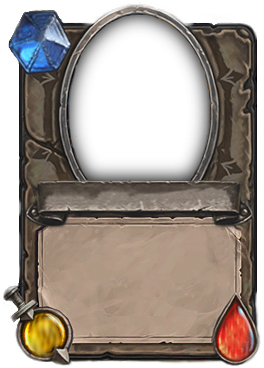

# Тестовое задание для компании "Rubius" :anger:

## Описание задания 

### [Текстовое описание - ТЗ](Test-description/Task.pdf)

### [Демо требуемого задания](Test-description/Demo.mp4)

### Подложка для карточек

## Решение

### Анализ ТЗ
 Можно выделить три основные сущности: **игровое поле**, **карточка**, **загрузка картинок**.
 Загрузка картинок будет реализована как отдельный сервис и свяазана с кор частью проекта
через интерфейс ILoadCards.
 Игровое поле является высокоуровневой сущностью по отношению к карточке. На первый взгляд
для организации их логики подходит паттерн Observer. Это позволит в дальнейшем легко добавлять
новые игровые сущности на сцену. Но есть нобходимость в синхронизации карточек между собой для 
 некоторых режимов загрузки, что сложно реализовать при таком подходе. 
  Т.к. проект 2Д, то можно задействовать архитектурный паттерн MVP, 
 что даст нам больший контроль над представлением игрового поля и разделение логики от представления.

### Общие соображения
1. Использовать шаблон Unity для 2D проектов
2. Архитектурный паттерн MVP like + сервисы
3. Внедрение зависимостей через сериализацю на сцене
4. Загрузку изображений для карточек производить через API UnityWebRequestTexture
5. При написании кода, придерживаться TDD подхода

### План работы
- [x] Инициализировать git репозиторий 
- [x] Развернуть новый юнити проект
- [X] Настроить рабочее окружение: 
  - IDE
  - тестовое окружение
  - Tween
  - GitHub
- [x] Написать сервис загрузки картинок
- [x] Написать логику для GameField и Card
- [x] Настроить префабы и сцену
- [x] Написать анимацию карточки
- [x] Финальная отладка и сборка проекта
